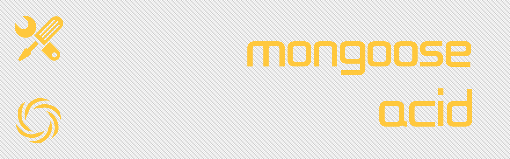

[](https://travis-ci.org/ithot-all/mongoose-acid)

[](https://npmjs.org/package/mongoose-acid)


# mongoose-acid
:sunglasses: mongoose事务助手

### 安装 
```
npm i mongoose-acid -S
``` 

### 必须项

```
nodejs >= 7.6 | mongoose >= 5.2 | mongodb >= 4.0
```
### 用法

#### 一般使用
```javascript
const Acid = require('mongoose-acid')
await Acid( async (session) => {
    await People.findOneAndUpdate({ name: 'Acid' },{ $inc: { balance: 30 } },{ session })
    await Account.findOneAndUpdate({ name: 'Blank'},{ $inc: { balance: -30 } },{ session })
    // ... 
})
```
#### 在koa中使用
```javascript
const Acid = require('mongoose-acid')
const app = new Koa()
app.use(Acid.middleware())
app.use(async (ctx) => {
    await ctx.acid(async (session) => {
      
    })
})
```

### session选项的位置

- `Model.create([], { session })`
- `Model.deleteOne(condition, { session })`
- `Model.deleteMany(condition, { session })`
- `Model.updateOne(condition, update, { session })`
- `Model.updateMany(condition, update, { session })`
- `Model.update(condition, update, { session })`
- `Model.insertMany(docs, { session })`
- `Model.findById(id, selects, { session })`
- `Model.findByIdAndUpdate(id, update, { session })`
- `Model.findByIdAndRemove(id, { session })`
- `Model.findByIdAndDelete(id, { session })`
- `Model.findOne(condition, selects, { session })`
- `Model.findOneAndUpdate(condition, update, { session })`
- `Model.findOneAndRemove(condition, { session })`
- `Model.findOneAndDelete(condition, { session })`
- `model.save({ session })` 
- `model.remove({ session })`

### 注意

- 注意如果model是通过设置了`session`选项的查询返回的那么不用再次设置
- 注意`Model.create`方法的第一个参数必须是数组，第二个参数才可以设置`session`选项

### 测试

```
npm test
```
